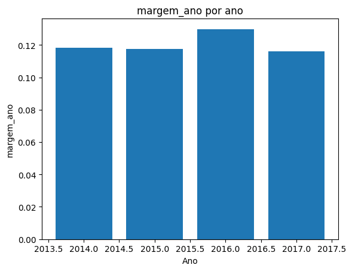
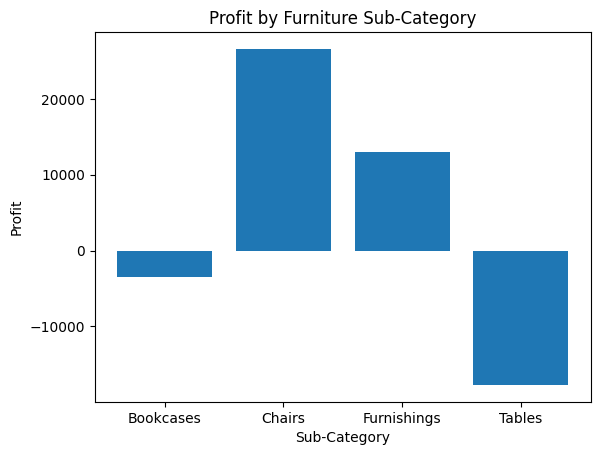
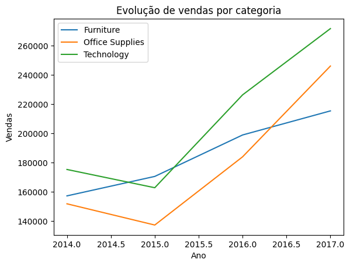

# Projeto Superstore — Análise de Vendas e Rentabilidade

Análise exploratória dos dados de vendas da Superstore (2014–2017), com foco em entender não só quanto a empresa vende, mas se esse crescimento se traduz em lucro de forma saudável.

## Sobre o dataset

- **9.994 linhas** e **21 colunas**
- Sem valores nulos e sem registros duplicados
- Cada linha representa um item de um pedido (um mesmo `Order ID` pode se repetir quando o pedido tem mais de um produto)

## Pergunta de negócio

A empresa vende bastante, mas será que consegue transformar isso em lucro de forma eficiente? Ou o crescimento em vendas está mascarando problemas de rentabilidade em partes específicas do negócio?

## Metodologia


## Metodologia

A análise foi dividida em três notebooks, cada um cobrindo uma etapa do raciocínio:

## Metodologia

A análise foi conduzida em etapas, partindo do geral para o específico, e está dividida em três notebooks:

1. **[`01_eda.ipynb`](notebooks/01_eda.ipynb)** — exploração inicial: limpeza, tipos de dados, verificação de nulos/duplicados, conversão de datas, totais gerais de vendas e lucro
2. **[`02_category_analysis.ipynb`](notebooks/02_category_analysis.ipynb)** — análise por categoria (Furniture, Office Supplies, Technology) por vendas, lucro e desconto médio; investigação aprofundada de Furniture, a categoria com o resultado mais preocupante, descendo ao nível de subcategoria (Chairs, Furnishings, Bookcases, Tables); criação da métrica Profit Margin (`Profit / Sales`) para comparar eficiência, não apenas valores absolutos; top 10 produtos
3. **[`03_time_analysis.ipynb`](notebooks/03_time_analysis.ipynb)** — análise temporal: evolução de vendas, quantidade, lucro e margem por ano; análise de sazonalidade com identificação de padrões mensais; evolução das categorias ao longo dos anos comparando trajetórias

## Principais descobertas

### Vendas, lucro e quantidade cresceram ano a ano

| Ano | Vendas | Quantidade | Profit |
|---|---|---|---|
| 2014 | 484.247 | 7.581 | 49.543 |
| 2015 | 470.532 | 7.979 | 61.618 |
| 2016 | 609.205 | 9.837 | 81.795 |
| 2017 | 733.215 | 12.476 | 93.439 |

O crescimento se acelera a partir de 2016 e vem acompanhado de aumento real na quantidade de produtos vendidos — não é só efeito de preço.

### A margem de lucro, porém, ficou estável (~12%)

| Ano | Margem |
|---|---|
| 2014 | 11,81% |
| 2015 | 11,75% |
| 2016 | 12,97% |
| 2017 | 11,59% |



Isso mostra que a empresa cresceu em **escala**, mas não em **eficiência**: o lucro aumentou porque se vendeu mais, não porque cada venda passou a ser mais rentável.

### O problema está concentrado em Furniture

- **Technology**: maior volume de vendas e boa margem — crescimento saudável
- **Office Supplies**: comportamento equilibrado entre vendas, lucro e margem
- **Furniture**: grande volume de vendas, mas rentabilidade comprometida



Dentro de Furniture, ao nível de subcategoria:

- **Chairs**: maior volume e Profit positivo (+26,5 mil)
- **Furnishings**: vendas menores, Profit positivo
- **Bookcases**: Profit negativo (-3,4 mil)
- **Tables**: prejuízo elevado (-17,7 mil)

O desconto médio é maior nessas subcategorias problemáticas, mas não explica sozinho o resultado negativo — o problema não é só desconto.



### Sazonalidade

As vendas são mais baixas em janeiro e fevereiro, e sobem consistentemente no último trimestre (setembro a dezembro), provavelmente puxadas por compras de fim de ano.

## Conclusão

A empresa apresenta crescimento consistente, mas existem oportunidades claras de melhorar a eficiência financeira. A análise identificou onde está o problema: as subcategorias Tables (-17,7 mil de Profit) e Bookcases (-3,4 mil de Profit) estão gerando perdas que puxam a margem geral para baixo. Já Chairs (+26,5 mil de Profit) e a categoria Technology mostram que é possível crescer com rentabilidade — ou seja, o problema não é estrutural, é pontual.

A partir disso, vamos:

- **Revisar as políticas de preços e descontos de Tables e Bookcases**, já que essas subcategorias têm vendas relevantes mas estão no vermelho — o ajuste aqui tem potencial direto de reverter prejuízo em lucro.
- **Direcionar mais investimento e atenção para Technology e Chairs**, replicando o que está funcionando nelas para o resto do portfólio.
- Com essas duas ações, a meta é **elevar a margem de lucro para além dos 12% atuais** nos próximos ciclos, sem depender apenas de vender mais.

## Estrutura do repositório

```
├── data/
│   └── Sample - Superstore.csv       # Dataset original utilizado na análise
├── notebooks/
│   ├── 01_eda.ipynb                  # Análise Exploratória de Dados inicial e limpeza
│   ├── 02_category_analysis.ipynb    # Investigação profunda de Categorias e Subcategorias
│   └── 03_time_analysis.ipynb        # Análise de Tendências Temporais e Sazonalidade
├── images/
│   └── ...                           # Gráficos exportados utilizados no relatório
└── README.md                         # Documentação do projeto
```

## Ferramentas utilizadas

- Python
- Pandas
- Matplotlib
- Google Colab

## Como executar

1. Clone o repositório
2. Abra qualquer um dos notebooks em `notebooks/` no Google Colab ou Jupyter
3. Ajuste o caminho de leitura do CSV para `data/Sample - Superstore.csv`
4. Execute as células em ordem

Cada notebook é independente e pode ser executado sozinho — todos incluem os imports e o carregamento do dataset no início.
