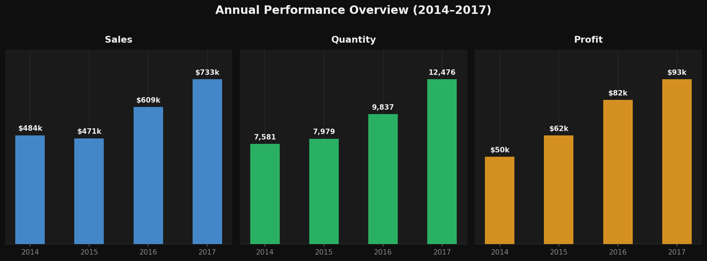
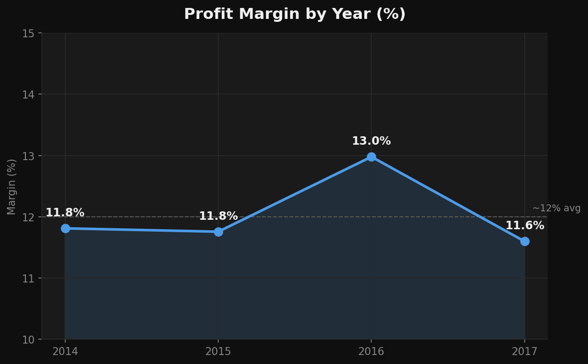
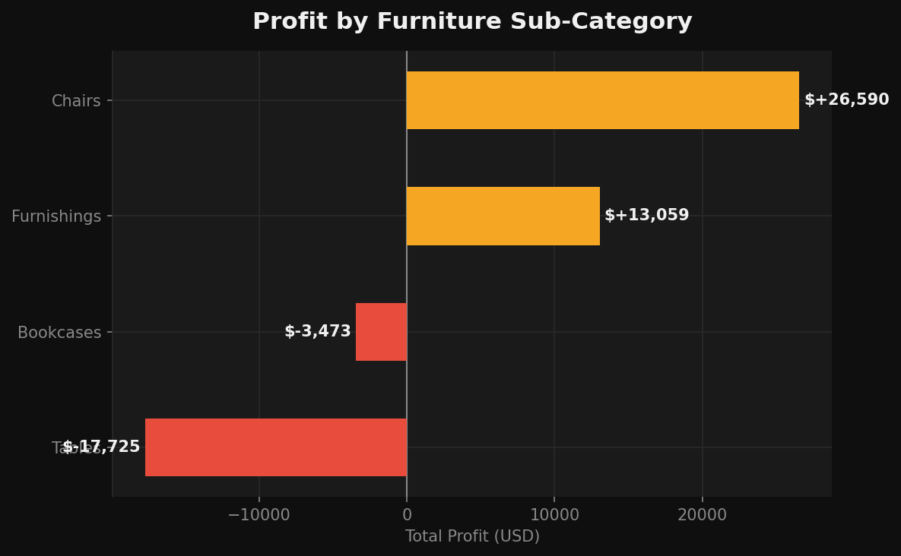
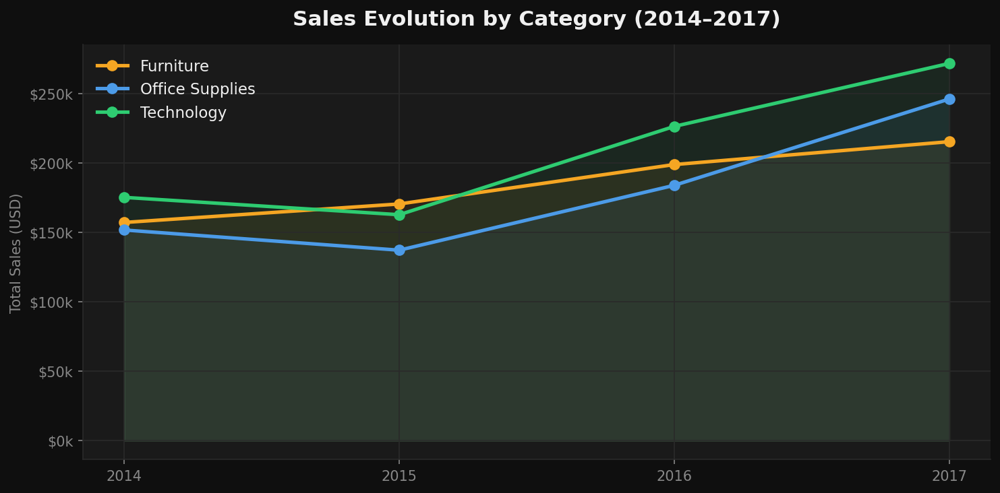
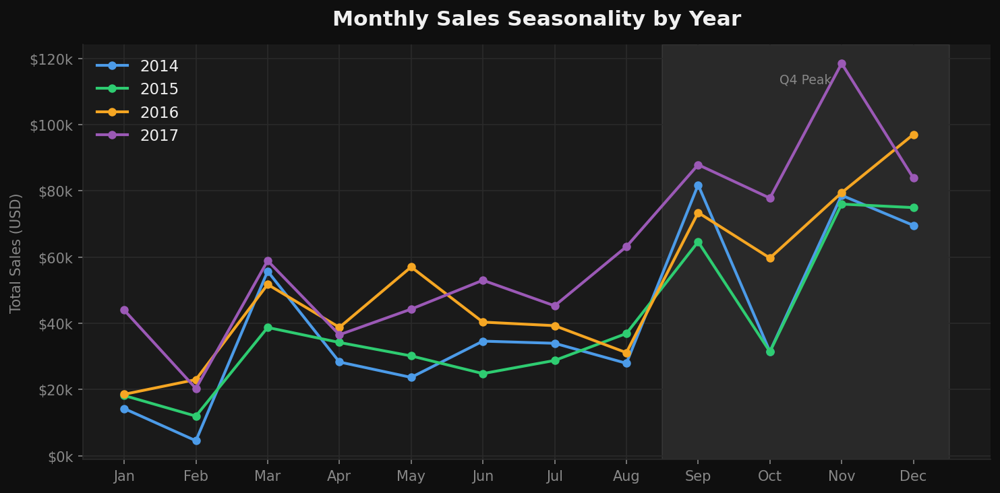
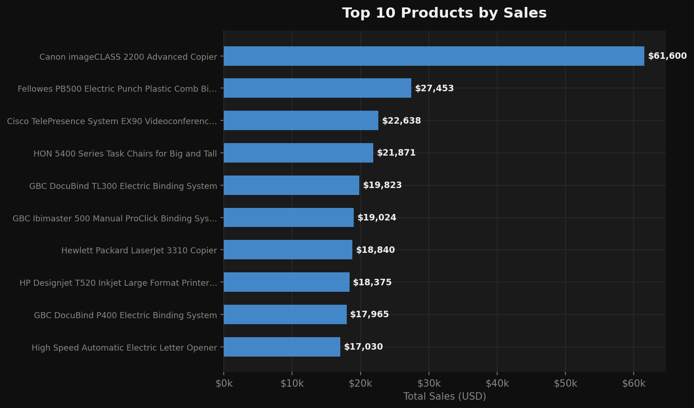

# Superstore Sales & Profitability Analysis
Exploratory analysis of retail sales data (2014–2017) investigating whether revenue growth translated into real profitability gains.

## Business Question

The company sells a lot — but is it actually becoming more profitable, or just selling more of the same?

---

## Key Findings

### 1. Sales, quantity and profit all grew — but not efficiency



Revenue grew from **$484k (2014)** to **$733k (2017)**, a 51% increase over four years. Quantity sold rose proportionally, confirming this is real volume growth — not just price inflation. Profit followed the same upward trend.

---

### 2. Profit margin stayed flat at ~12% throughout



Despite consistent revenue growth, profit margin hovered around **11–13% every year**. The company scaled its operations but did not improve financial efficiency — every dollar of revenue kept generating roughly the same profit. This signals an opportunity: fixing low-margin segments could unlock gains without needing more sales volume.

---

### 3. The profitability problem is concentrated in Furniture



Furniture has solid sales but a critical profitability issue at the sub-category level:

- **Tables**: **-$17,700** in total profit — the biggest drag on the business
- **Bookcases**: **-$3,400** in total profit
- **Chairs**: **+$26,500** — profitable and high-volume
- **Furnishings**: positive, smaller scale

Tables and Bookcases are actively destroying value. Higher average discounts on these sub-categories contribute to the losses, but discount alone doesn't fully explain the negative margins — the underlying cost structure is also a factor.

---

### 4. Technology leads growth; Furniture lags behind



Technology grew the fastest and maintains the healthiest margins. Office Supplies showed steady, balanced growth. Furniture grew in sales volume but without the profitability to match — a pattern that becomes more concerning when zooming into its sub-categories.

---

### 5. Sales peak consistently in Q4 every year



All four years show the same seasonal pattern: sales drop in January–February and climb sharply from September through December. The Q4 surge is consistent and predictable — a clear opportunity for targeted inventory and promotional planning ahead of the peak period.

---

### 6. Top 10 products by revenue



The highest-revenue products are dominated by Technology items (phones, copiers, machines). This reinforces the category-level finding: Technology is the company's most commercially successful segment.

---

## Conclusion & Recommendations

The company has consistent growth, but the flat margin (~12%) indicates scale without efficiency improvement. The analysis pinpoints exactly where value is being lost:

- **Revise pricing and discount policies for Tables and Bookcases** — these sub-categories generate real losses that pull the overall margin down. Fixing them has direct profit impact without needing more volume.
- **Double down on Technology and Chairs** — both grow healthily and profitably. Replicating what works here across the rest of the portfolio is the clearest path to margin improvement.
- **Use Q4 seasonality proactively** — prepare inventory and campaigns ahead of September, when demand consistently begins its annual surge.

The target: **push profit margin above 12%** through efficiency gains, not just volume growth.

---

## Project Structure

```
superstore-sales-analysis
│
├── data/
│   └── Sample - Superstore.csv
│
├── notebooks/
│   ├── 01_eda.ipynb               — Initial exploration, data cleaning, totals
│   ├── 02_category_analysis.ipynb — Category & sub-category deep dive
│   └── 03_time_analysis.ipynb     — Temporal trends and seasonality
│
├── images/
│   ├── ss_chart1_annual.png
│   ├── ss_chart2_margin.png
│   ├── ss_chart3_furniture.png
│   ├── ss_chart4_categories.png
│   ├── ss_chart5_seasonality.png
│   └── ss_chart6_top10.png
│
└── README.md
```

---

## Dataset

- **Source:** [Superstore Sales Dataset — Kaggle](https://www.kaggle.com/datasets/vivek468/superstore-dataset-final)
- **Records:** 9,994 rows × 21 columns
- **Period:** 2014–2017
- **No null values or duplicate records found**

---

## Tools Used

- Python — Pandas, Matplotlib
- Google Colab
- GitHub
