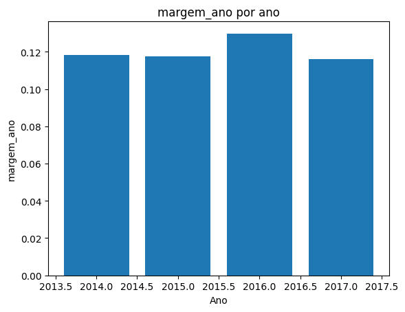
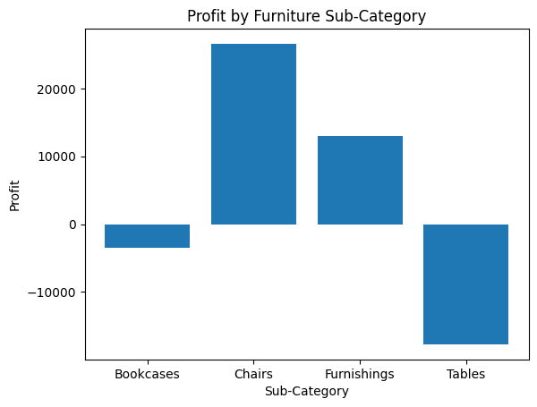
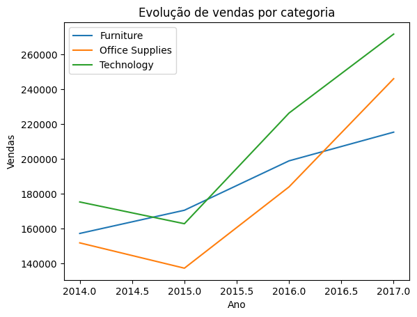

# Superstore Project — Sales and Profitability Analysis

Exploratory analysis of Superstore sales data (2014–2017), focused on understanding not just how much the company sells, but whether that growth translates into healthy profitability.

## About the dataset

- **9,994 rows** and **21 columns**
- No null values and no duplicate records
- Each row represents an item within an order (a single `Order ID` can repeat when an order contains more than one product)
- This is the classic **Sample Superstore** dataset (widely used for Tableau/Power BI practice, sourced from Kaggle), not real company data

## Business question

The company sells a lot, but is it turning that into profit efficiently? Or is sales growth masking profitability problems in specific parts of the business?

## Methodology

The analysis moved from general to specific:

1. **Initial exploration** — data cleaning, data types, null/duplicate checks
2. **Category-level analysis** (Furniture, Office Supplies, Technology) — sales, profit, and average discount
3. **Deep dive into Furniture**, the category with the most concerning results, breaking it down to subcategory level (Chairs, Furnishings, Bookcases, Tables)
4. **Creation of a Profit Margin metric** (`Profit / Sales`) to compare efficiency, not just absolute values
5. **Time-based analysis** — evolution of sales, quantity, profit, and margin by year
6. **Seasonality analysis** — identification of monthly patterns
7. **Category evolution over time** — comparing trajectories across categories

## Key findings

### 1. Sales, profit, and quantity grew year over year

| Year | Sales   | Quantity | Profit |
|------|---------|----------|--------|
| 2014 | 484,247 | 7,581    | 49,543 |
| 2015 | 470,532 | 7,979    | 61,618 |
| 2016 | 609,205 | 9,837    | 81,795 |
| 2017 | 733,215 | 12,476   | 93,439 |

Growth accelerates from 2016 onward and is accompanied by a real increase in units sold — not just a price effect.

### 2. Profit margin, however, stayed flat (~12%)

| Year | Margin |
|------|--------|
| 2014 | 11.81% |
| 2015 | 11.75% |
| 2016 | 12.97% |
| 2017 | 11.59% |



This shows the company grew in **scale**, but not in **efficiency**: profit went up because more was sold, not because each sale became more profitable.

### 3. The problem is concentrated in Furniture

- **Technology**: highest sales volume and good margin — healthy growth
- **Office Supplies**: balanced behavior across sales, profit, and margin
- **Furniture**: high sales volume, but compromised profitability



Within Furniture, at the subcategory level:

- **Chairs**: highest volume, positive profit (+26.5k)
- **Furnishings**: lower sales, positive profit
- **Bookcases**: negative profit (-3.4k)
- **Tables**: significant loss (-17.7k)

Average discount is higher in these problematic subcategories, but discount alone doesn't explain the negative result.



### 4. Seasonality

Sales are lowest in January and February, and rise consistently in the last quarter (September–December), likely driven by year-end purchases.

## Conclusion

The company shows consistent growth, but there are clear opportunities to improve financial efficiency. The analysis pinpointed the problem: the Tables (-17.7k profit) and Bookcases (-3.4k profit) subcategories are generating losses that drag down the overall margin. Meanwhile, Chairs (+26.5k profit) and the Technology category show that growing profitably is possible — the problem isn't structural, it's specific.

Based on this, next steps would be to:

- **Review pricing and discount policy for Tables and Bookcases**, since these subcategories have relevant sales volume but are in the red — fixing this has direct potential to turn losses into profit.
- **Direct more investment and attention toward Technology and Chairs**, replicating what's working there across the rest of the portfolio.
- With these two actions, the goal is to **raise the profit margin beyond the current 12%** in upcoming cycles, without relying solely on higher sales volume.

## Repository structure

```
├── data/
│   └── Sample - Superstore.csv       # Original dataset used in the analysis
├── notebooks/
│   ├── 01_eda.ipynb                  # Initial exploratory data analysis and cleaning
│   ├── 02_category_analysis.ipynb    # Deep dive into categories and subcategories
│   └── 03_time_analysis.ipynb        # Time trend and seasonality analysis
├── images/
│   └── ...                           # Charts exported for the report
└── README.md                         # Project documentation
```

## Tools used

- Python
- Pandas
- Matplotlib
- Google Colab

## How to run

1. Clone the repository
2. Open `notebooks/01_eda.ipynb` in Google Colab or Jupyter (then `02_category_analysis.ipynb` and `03_time_analysis.ipynb`, in order)
3. Adjust the CSV read path to `data/Sample - Superstore.csv`
4. Run the cells in order
